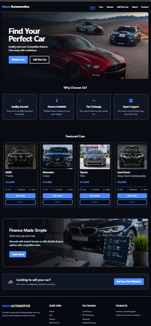
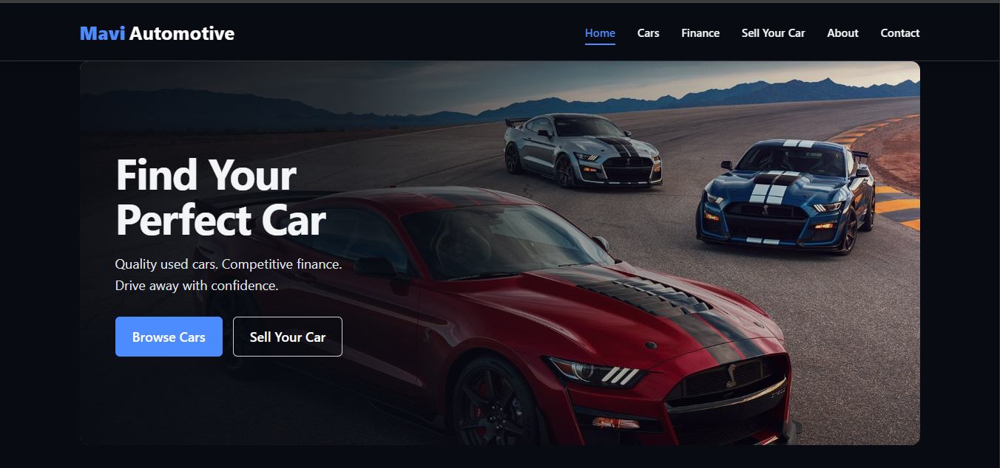
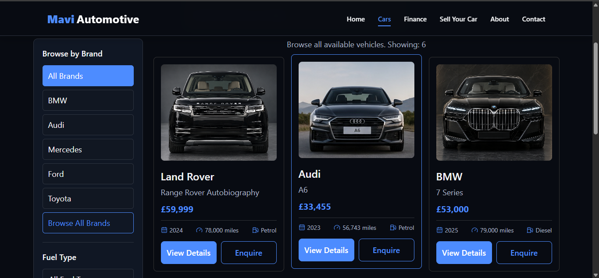

# Mavi Automotive

A production-ready full-stack car dealership platform built with the MERN stack. Customers can browse and filter vehicles, view detailed listings, submit vehicle-specific enquiries, and explore finance options. A secure admin portal provides inventory and enquiry management.

## Live Demo

[Visit Mavi Automotive](https://mavi-automotive.onrender.com)

> The application uses Render's free hosting tier, so the first request after inactivity may take up to a minute.

## Screenshots

### Home Page



### Vehicle Listings



### Admin Dashboard




## Key Features

### Customer Website

- Browse available vehicles
- Search, filter, sort, and paginate listings
- View detailed vehicle specifications
- Explore vehicle image galleries
- Submit enquiries linked to a selected vehicle
- Use the finance calculator
- Navigate a responsive desktop, tablet, and mobile interface

### Admin Portal

- Secure administrator authentication
- Protected admin pages and API endpoints
- Add new vehicle listings
- Edit existing vehicle information
- Delete vehicle listings
- Upload multiple vehicle images
- View customer enquiries
- View the vehicle connected to each enquiry
- Update enquiry status to New, Contacted, or Closed
- Manage inventory through a responsive dashboard

## Technology Stack

### Frontend

- React
- React Router
- JavaScript
- Vite
- CSS
- Lucide React

### Backend

- Node.js
- Express
- MongoDB
- Mongoose
- JSON Web Tokens
- bcrypt
- Multer
- Helmet
- Express Rate Limit

### Cloud Services

- MongoDB Atlas
- Cloudinary
- Render
- GitHub

## Security Features

- Password hashing with bcrypt
- Authentication tokens stored in HTTP-only cookies
- Protected administrator routes
- Protected inventory and enquiry API endpoints
- Secure cookies in production
- Login rate limiting
- Customer enquiry rate limiting
- HTTP security headers provided by Helmet
- Environment-based secret management
- Server-side request validation
- Controlled API error responses

## Project Structure

```text
mavi-automotive/
├── backend/
│   ├── config/
│   ├── middleware/
│   ├── models/
│   ├── routes/
│   └── server.js
├── src/
│   ├── assets/
│   ├── components/
│   ├── context/
│   ├── pages/
│   └── App.jsx
├── package.json
├── vite.config.js
└── README.md
```

## Running the Project Locally

### Prerequisites

Before starting, install or create:

- Node.js
- npm
- MongoDB Atlas account
- Cloudinary account

### 1. Clone the repository

```bash
git clone https://github.com/4mavi27/mavi-automotive.git
cd mavi-automotive
```

### 2. Install frontend dependencies

```bash
npm install
```

### 3. Install backend dependencies

```bash
npm install --prefix backend
```

### 4. Configure environment variables

Create a `.env` file inside the `backend` directory:

```env
MONGO_URI=your_mongodb_connection_string
JWT_SECRET=your_secure_jwt_secret
CLOUDINARY_CLOUD_NAME=your_cloudinary_cloud_name
CLOUDINARY_API_KEY=your_cloudinary_api_key
CLOUDINARY_API_SECRET=your_cloudinary_api_secret
```

Never commit the `.env` file or expose its values publicly.

### 5. Start the backend

From the project root:

```bash
npm start
```

The root start script launches the Express server from the `backend` directory.

### 6. Start the frontend

Open a separate terminal in the project root:

```bash
npm run dev
```

The development frontend runs at:

```text
http://localhost:5173
```

Development API requests are proxied to:

```text
http://localhost:5000
```

## Production Build

Install dependencies and create the production frontend build:

```bash
npm run render-build
```

Set the following environment variable on the hosting platform:

```env
NODE_ENV=production
```

Start the production server:

```bash
npm start
```

In production, Express serves the compiled React application and handles all `/api` requests from the same domain.

## Main API Endpoints

| Method | Endpoint | Access | Purpose |
|---|---|---|---|
| GET | `/api/cars` | Public | Fetch all vehicles |
| GET | `/api/cars/:id` | Public | Fetch one vehicle |
| POST | `/api/enquiries` | Public | Submit an enquiry |
| POST | `/api/auth/login` | Public | Log in as administrator |
| POST | `/api/auth/logout` | Admin | End the admin session |
| GET | `/api/auth/me` | Admin | Verify the admin session |
| POST | `/api/cars` | Admin | Add a vehicle |
| PUT | `/api/cars/:id` | Admin | Update a vehicle |
| DELETE | `/api/cars/:id` | Admin | Delete a vehicle |
| POST | `/api/upload` | Admin | Upload vehicle images |
| GET | `/api/enquiries` | Admin | View customer enquiries |
| PATCH | `/api/enquiries/:id/status` | Admin | Update enquiry status |

## Deployment

The application is deployed as a single Render web service:

1. Render installs the frontend and backend dependencies.
2. Vite creates the optimized React production build.
3. Express starts the backend server.
4. Express serves the React build from the `dist` directory.
5. Frontend and API requests use the same production domain.

## Author

**Ameer Muavia**

- GitHub: [4mavi27](https://github.com/4mavi27)
- Live project: [Mavi Automotive](https://mavi-automotive.onrender.com)